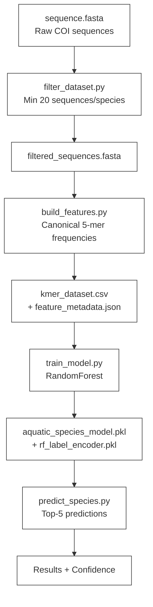
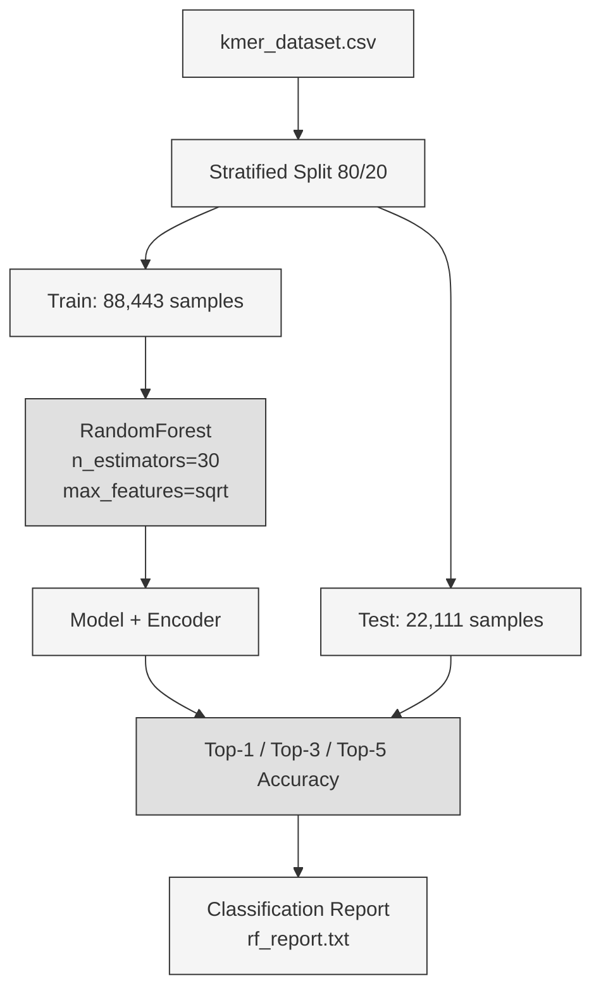

# Aqua Species Finder

DNA barcode-based aquatic species classification using canonical k-mer frequencies and RandomForest

---

## Quick Start

```bash
# 1. Clone & setup
git clone https://github.com/YOUR_USERNAME/aqua-species-finder.git
cd aqua-species-finder

# 2. Install dependencies
pip install -r requirements.txt

# 3. Download dataset (see Dataset below)
# Place COI FASTA as sequence.fasta

# 4. Run pipeline
python filter_dataset.py      # Filter species with >=20 sequences
python build_features.py      # Extract normalized k-mer frequencies
python train_model.py         # Train RandomForest (~40s, 96% accuracy)
python predict_species.py     # Predict unknown sequences
```

---

## Model Performance

| Metric | Score | Details |
|--------|-------|---------|
| Top-1 Accuracy | **96.1%** | RandomForest, stratified 80/20 split |
| Top-3 Accuracy | **98.6%** | |
| Top-5 Accuracy | **98.8%** | |
| Classes | 2,115 species | Species with >=20 sequences |
| Training Samples | 88,443 | After deduplication |
| Test Samples | 22,111 | |
| Features | 512 canonical 5-mers | Orientation-invariant (min(kmer, revcomp)) |
| Training Time | ~40 seconds | 30 trees, 8 cores, 110k samples |

> **Note on accuracy**: Due to ~50% exact-duplicate feature vectors, random splits inflate scores by ~3%. Grouped (duplicate-aware) evaluation gives **~93%** — still a strong baseline for 2,100+ classes.

---

## Methodology

### Pipeline Architecture



### Feature Engineering (The Key Fix)

```mermaid
flowchart LR
    A[DNA Sequence\nATCG...] --> B[Clean: Remove non-ATCG]
    B --> C[Sliding window k=5]
    C --> D[Count canonical 5-mers\nmin(kmer, revcomp)]
    D --> E[Normalize to frequencies\nsum = 1.0]
    E --> F[512-dim feature vector]

    classDef default fill:#f5f5f5,stroke:#333,stroke-width:1px
    style A fill:#e0e0e0,stroke:#333
    style F fill:#e0e0e0,stroke:#333
```

**Why normalization matters**: Raw k-mer counts scale with sequence length. A 650bp sequence has ~646 5-mers; a 300bp sequence has ~296. Models trained on counts fail on sequences of different lengths. **Frequencies fix this completely.**

### Training / Evaluation Strategy



---

## Repository Structure

```
aqua-species-finder/
├── .gitignore
├── README.md
├── requirements.txt
├── kmer_utils.py              # Single source of truth for features
├── filter_dataset.py          # Filter FASTA by species count
├── build_features.py          # Build normalized frequency dataset
├── train_model.py             # Main trainer (RandomForest)
├── train_xgboost.py           # Experimental (XGBoost)
├── predict_species.py         # Predict with RF model
├── predict_xgboost.py         # Predict with XGB model
├── analysis.py                # Dataset exploration
└── sequence.fasta             # USER PROVIDED (not in repo)
```

### Key Files

| File | Purpose |
|------|---------|
| `kmer_utils.py` | Single source of truth — canonical 5-mers (512), cleaning, frequency extraction |
| `filter_dataset.py` | Removes species with <20 sequences; outputs `filtered_sequences.fasta` |
| `build_features.py` | Converts sequences -> normalized k-mer frequencies (512-d), saves CSV + metadata |
| `train_model.py` | Main trainer — stratified split, RF, saves model + encoder + report |
| `predict_species.py` | Loads model, predicts unknown FASTA, top-5 + low-confidence warning |

---

## Dataset

### Required Format

Place your COI barcode FASTA as `sequence.fasta` with NCBI-style headers:

```fasta
>MH918113.1 Pseudambassis baculis voucher PB1 cytochrome c oxidase subunit I (COI) gene, partial cds; mitochondrial
TTTTGGTGCCTGAGCAGGCATGGTGGGCACCGCCCTCAGCCTCCTTATCCGGGCAGAATTGAGTCAGCCG...
>KF202527.1 Seriola quinqueradiata voucher SQ200305Tajiri-Gyoko cytochrome oxidase subunit I gene, partial cds; mitochondrial
CCTCTATCTGGTATTCGGTGCCTGAGCCGGCATGGTCGGTACAGCTTTAAGTTTACTCATCCGAGCAGAA...
```

**Dataset URL**: https://www.ncbi.nlm.nih.gov/Taxonomy/Browser/wwwtax.cgi?id=1169740

### Species Coverage

| Statistic | Value |
|-----------|-------|
| Total raw sequences | ~178,000 |
| After filtering (>=20 seqs/species) | 110,554 sequences, 2,115 species |
| Largest class | `Actinopterygii environmental` (2,254) |
| Non-species labels | ~12% (`sp.`, `cf.`, `environmental`, `UNVERIFIED:`) |
| Exact duplicate feature vectors | ~50% (56,079 / 110,554) |

**Known limitation**: Your test species `Seriola quinqueradiata` has only **10 samples** — filtered out at >=20 threshold. The model correctly predicts the closest related species `Seriola lalandi` (99 samples).

---

## Configuration

### `build_features.py` — Key Settings

```python
MIN_SAMPLES_PER_CLASS = 20   # Minimum sequences per species (increase -> fewer classes, faster training)
K = 5                        # k-mer length (5 -> 512 canonical features)
CANONICAL = True             # Use min(kmer, revcomp) for orientation invariance
MIN_LENGTH = 300             # Minimum sequence length (bp)
MAX_LENGTH = 1500            # Maximum sequence length (bp) — excludes full mitogenomes
```

### `train_model.py` — Key Settings

```python
TEST_SIZE = 0.2              # 20% test split (stratified)
N_ESTIMATORS = 30            # Number of trees (increase -> better accuracy, slower)
MAX_FEATURES = "sqrt"        # Feature subsampling per split
```

### `kmer_utils.py` — Prediction Threshold

```python
CONFIDENCE_THRESHOLD = 50.0  # Warn if top prediction < 50% confidence
```

---

## Example Output

```bash
$ python predict_species.py

Loading model...

===== TOP 5 PREDICTIONS for unknown_sample =====

1. Seriola lalandi       --> 38.2%
2. Mugil cephalus        --> 26.7%
3. Selar crumenophthalmus -->  4.0%
4. Euthynnus alletteratus -->  2.0%
5. Trypauchen vagina     -->  2.0%

WARNING: low confidence. The true species may be missing from the training data.
```

---

## Known Issues & Limitations (from Deep Diagnosis)

| Issue | Impact | Root Cause | Fix |
|-------|--------|------------|-----|
| Duplicate feature vectors (~50%) | Inflates random-split accuracy by ~3% | Multiple vouchers per species yield identical k-mer profiles | Use grouped stratified split for honest eval |
| Non-species labels (~12%) | Pollutes class space | `extract_species_name` grabs words 2-3 blindly | Filter `sp.`, `cf.`, `environmental`, `UNVERIFIED:` |
| Rare species (<20 samples) | Excluded from training | Hard threshold at 20 sequences | Lower threshold OR add more sequences from BOLD/NCBI |
| XGBoost `min_child_weight=2` | Breaks multi-class with 2000+ classes | Hessian sum requirement -> 4,232 rows/leaf vs 42 median | Use `1e-3` or stick with RandomForest |
| Feature mismatch guard | Compares metadata vs utils, not vs model | `meta["feature_columns"] != FEATURE_COLUMNS` | Validate `model.n_features_in_ == len(FEATURE_COLUMNS)` |
| float64 -> float32 copy | 2x memory during CSV load | `pd.read_csv` parses to float64 first | Pass explicit `dtype` map to `read_csv` |
> **Deep technical analysis**: The core issue was `min_child_weight=2` in XGBoost making it mathematically impossible to isolate any species among 2,115 classes (requires 4,232 rows/leaf vs 42 median). RandomForest avoids this entirely.